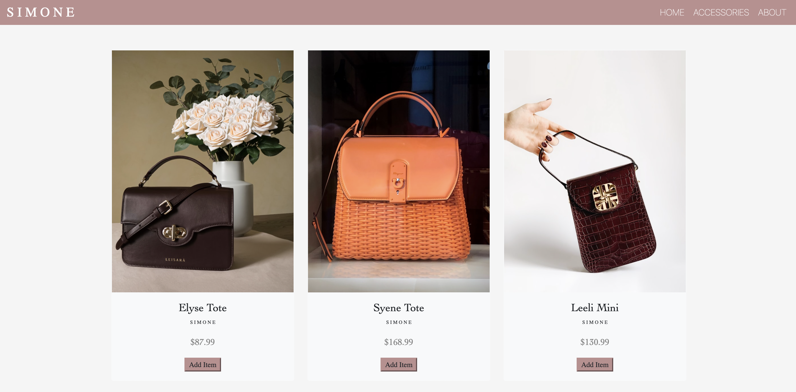

# Hi there 👋

***Languages***

• Java, Javascript, CSS, HTML

**Frameworks**

• Spring Boot, Node.js, Bootstrap

***Tools I have used:***

• Intellij, VS Code

<!--
**amilhousecunningham/amilhousecunningham** is a ✨ _special_ ✨ repository because its `README.md` (this file) appears on your GitHub profile.

Here are some ideas to get you started:

- 🔭 I’m currently working on ...
- 🌱 I’m currently learning ...
- 👯 I’m looking to collaborate on ...
- 🤔 I’m looking for help with ...
- 💬 Ask me about ...
- 📫 How to reach me: ...
- 😄 Pronouns: ...
- ⚡ Fun fact: ...
-->

## Featured Projects

### O N Y X Restaurant: https://amilhousecunningham.github.io/onxy-restaurant/#
I created this restaurant website using HTML, CSS, and Bootstrap. 

***-Ongoing Project***

---
### SIMONE eCommerce Site: https://amilhousecunningham.github.io/online-store/index.html
I created this restaurant website using HTML, CSS, Bootstrap, and JavaScript. 

***-Ongoing Project***

---

