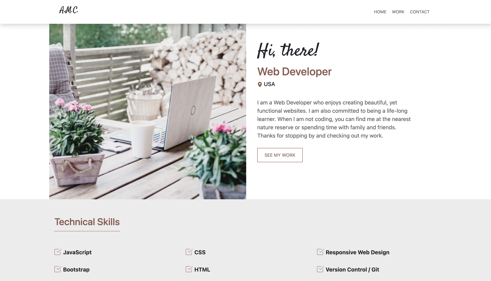

# Hi there 👋

[***Technical Skills:***
Javascript, Bootstrap, CSS, HTML

<!--
**amilhousecunningham/amilhousecunningham** is a ✨ _special_ ✨ repository because its `README.md` (this file) appears on your GitHub profile.

Here are some ideas to get you started:

- 🔭 I’m currently working on ...
- 🌱 I’m currently learning ...
- 👯 I’m looking to collaborate on ...
- 🤔 I’m looking for help with ...
- 💬 Ask me about ...
- 📫 How to reach me: ...
- 😄 Pronouns: ...
- ⚡ Fun fact: ...
-->

## Portfolio
***Website:*** https://amilhousecunningham.github.io/portfolio-website/

My portfolio highlights the projects listed below.

---

## Featured Projects

### SIMONE eCommerce Site:
***Website:*** https://amilhousecunningham.github.io/online-store/index.html

***Code:*** https://github.com/amilhousecunningham/online-store

I created this eCommerce website using HTML, CSS, Bootstrap, and JavaScript. 

<!-- ***-Ongoing Project*** -->

---

### Portfolio Home Page Site:
***Website:*** https://amilhousecunningham.github.io/home-page/

***Code:*** https://github.com/amilhousecunningham/home-page

I created this portfolio home page using HTML, CSS, and Bootstrap. 

<!-- ***-Ongoing Project*** -->

---
### O N Y X Restaurant Site: 
***Website:*** https://amilhousecunningham.github.io/onxy-restaurant/#

***Code:*** https://github.com/amilhousecunningham/onxy-restaurant

I created this restaurant website using HTML, CSS, and Bootstrap. 

<!-- ***-Ongoing Project*** -->

---

### Landing Page for Floral Site:
***Website:*** https://amilhousecunningham.github.io/landing_page/

***Code:*** https://github.com/amilhousecunningham/landing_page

I created this landing page using HTML and CSS. 

<!-- ***-Ongoing Project*** 
 -->

---](url)

